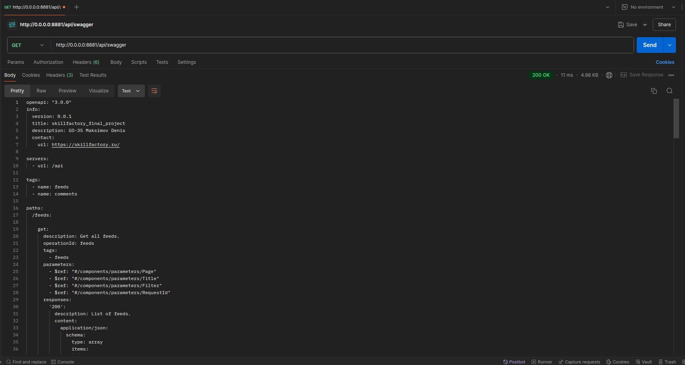
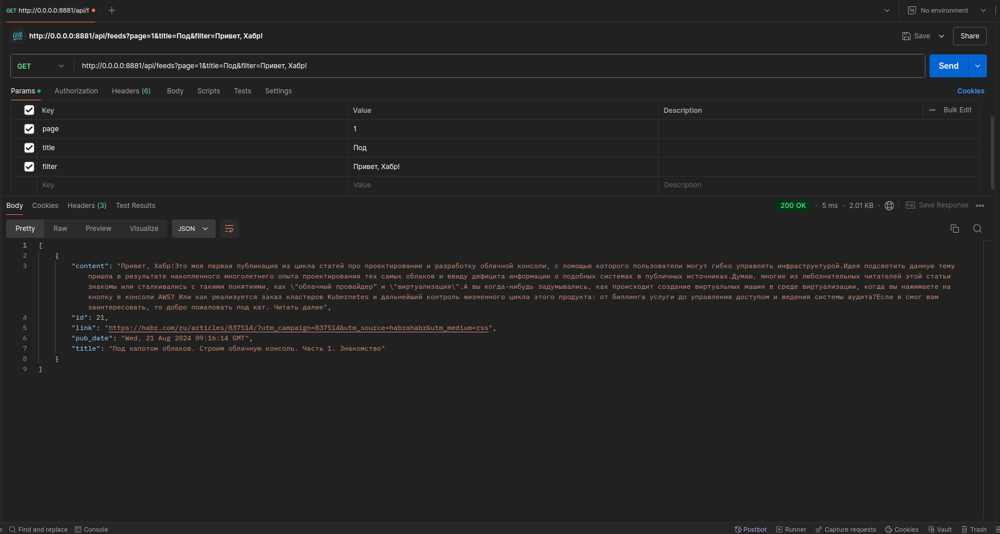
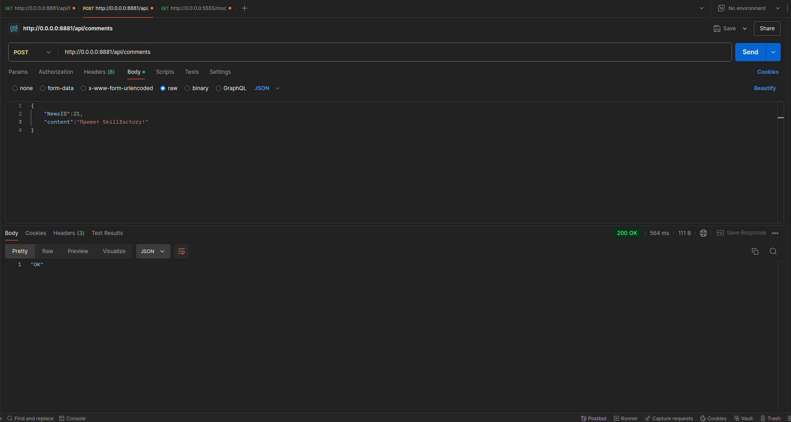
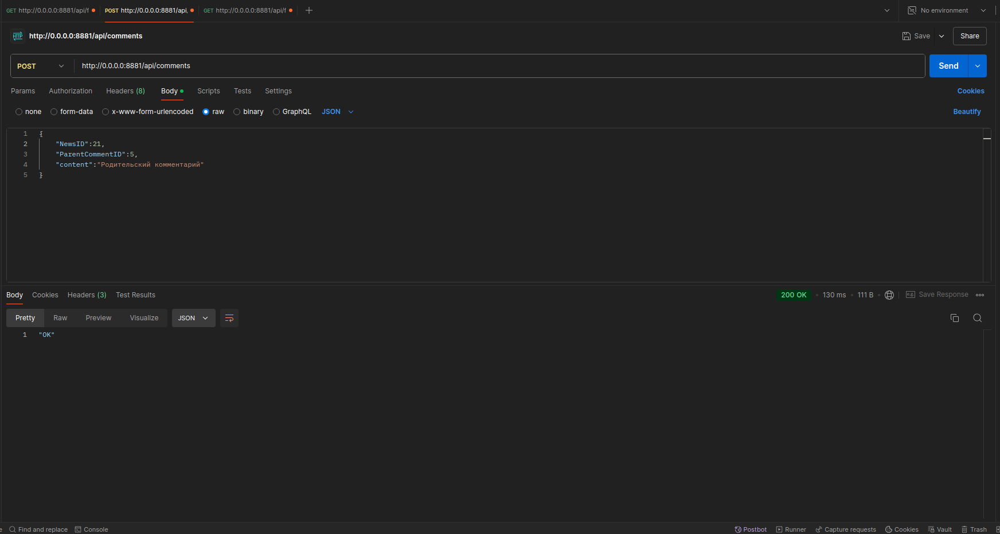
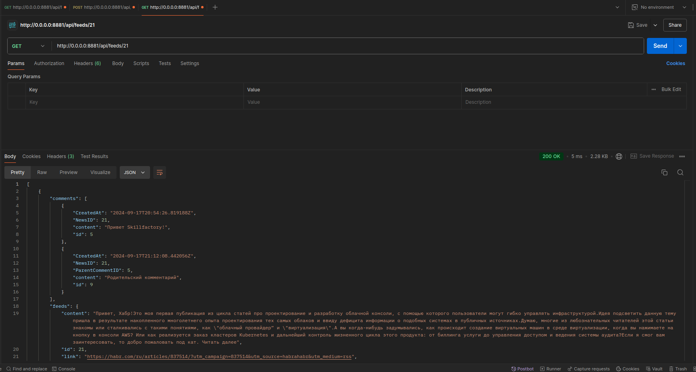

# Запуск  

1. Сколнировать репозиторий:
```bash   
git clone https://github.com/MaksimovDenis/SkillFactory_FinalProject.git
```
2. Перейти в директорию проекта (если Вы не в ней).  
```bash      
cd SkillFactory_FinalProject
```

3. Из дериктории проекта выполнить команды:  
```bash      
docker compose up --build 
```
4. Остановка  
```bash      
docker compose down
```
# Порты
- 8881 - API-gateway  
- 8882 - Comments  
- 8883 - News  
- 8884 - Censorship  
- 5433 - News-db  
- 5432 - Comments-db  
- 5000 - Deep-Pavlov AI model.    

# Реализация  
- Подход с чистой архитектурой    
- Язык программирование: Golang 1.22   
- Для реализации http сервера использовалась библиотека gin.  
- Кодогенерация oapi-codegen, swagger - (https://github.com/MaksimovDenis/SkillFactory_FinalProject/blob/main/SkillFactory_APIGateway/swagger.yaml)  
- В сервисе comments, для вазимодействия с БД применялась sqlc.  
- Системы койнтенеразации - docker, docker-compose.   

# Сервис цензурирования комментариев - censorship.
- Сервис использует ИИ модель **deep-pavlov**, которая позволяет определить негативную лексику в комментарии.  
(https://hub.docker.com/r/deeppavlov/base-cpu)  
(https://deeppavlov.ai/)  

# Примеры запросов
- Эндпоинт **GET /swagger**

- Эндпоинт **GET /api/feeds**

- Эндпоинт **GET /api/feeds?page=1&title=Под&filter=Пирвет, Хабр!**

- Эндпоинт **POST /api/comments**

- Эндпоинт **POST /api/comments**

- Эндпоинт **GET /api/feeds/21**
